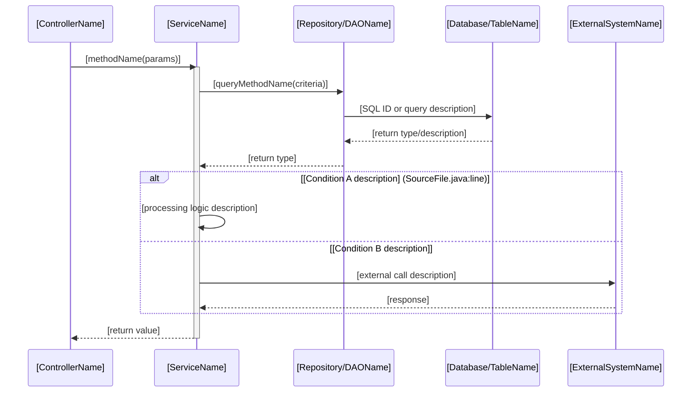
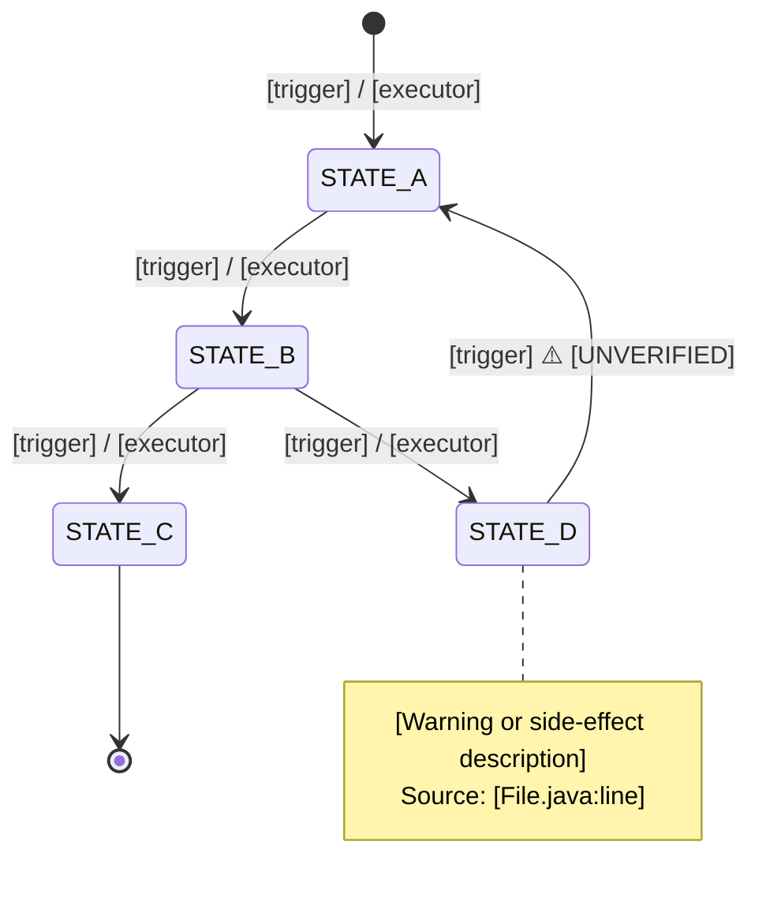
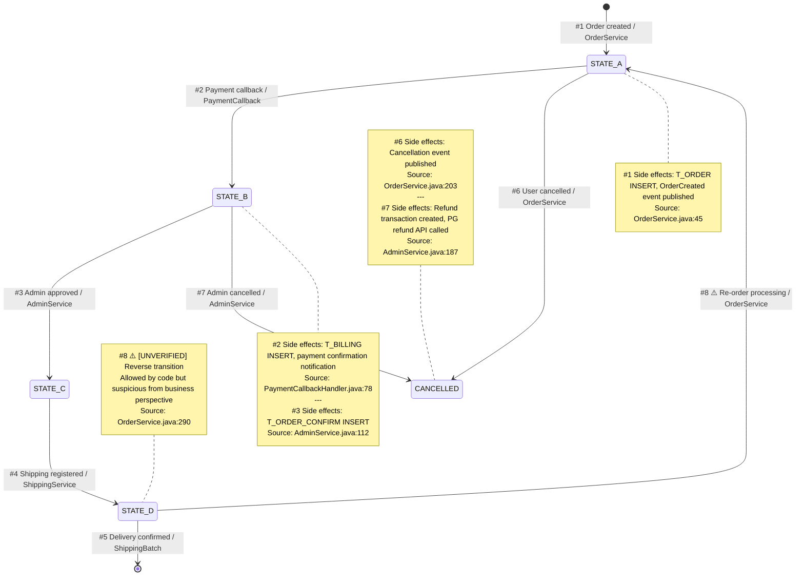
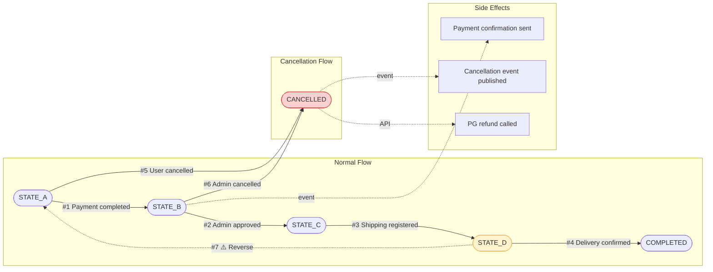

# Output Format Specifications

This document defines the exact format for each deliverable generated by the Legacy Analysis Skill.
Refer to this document from SKILL.md when authoring deliverables.

---

## 1. Sequence Diagram (Mermaid sequenceDiagram)

### Rules

- **Participant names**: Class name or system name (short aliases allowed)
- **Messages**: `methodName(key params)` — if 3+ parameters, include only the most important 1–2
- **Conditional branches**: `alt` (if-else), `opt` (if only), `loop` (iteration)
- **Asynchronous calls**: Dashed arrow `-->>`
- **DB operations**: Separate participant as `Database` or table name
- **External APIs**: Label participant as `<<external>> SystemName`
- **Depth limit**: If the call chain exceeds 5 levels, split into a sub-diagram and use `ref` notation

### Template



### When to Split

Split a sequence diagram into sub-diagrams when any of the following are exceeded:

- More than 8 participants
- More than 3 levels of nested alt/opt
- More than 80 total lines

When splitting, annotate the main diagram with `ref over S,R: See [Sub-diagram Title]`.

---

## 2. Business Rules Table

### Rules

- **Rule ID**: `BR-[3-digit sequence]` (e.g., BR-001). Number ranges can be partitioned by module.
- **Condition**: Transcribe the code's conditional expression; annotate variable names with business meaning in parentheses
- **Basis**: Where the rule is defined — choose one of: `Hardcoded`, `DB(table.column)`, `Config(filename.key)`, `External API response`
- **Compound conditions**: If conditions are joined by AND/OR, either split into separate rules or explicitly annotate the logic in the condition cell

### Template

```markdown
# Business Rules — [Module Name]

> **Version**: v1.0 | **Last updated**: YYYY-MM-DD
> **Analysis scope**: [Full path of entry point method]

| Rule ID | Rule Name   | Condition                               | Action             | Source           | Basis                 | Notes        |
| ------- | ----------- | --------------------------------------- | ------------------ | ---------------- | --------------------- | ------------ |
| BR-001  | [Rule name] | `[code condition]` ([business meaning]) | [Action performed] | [File.java:line] | [Hardcoded/DB/Config] |              |
| BR-002  |             |                                         |                    |                  |                       | [UNVERIFIED] |

### Inter-rule Dependencies

- BR-001 → BR-003: BR-003 is only evaluated if BR-001 is true
- BR-005 ⊕ BR-006: Mutually exclusive (cannot both be true)
```

---

## 3. State Transition Diagram (Mermaid stateDiagram-v2)

### Rules

- **State names**: Use the exact values from code (e.g., `PAID`, `CANCELLED`)
- **Transition labels**: Format as `[trigger] / [executor]`
- **Abnormal transitions**: Mark with `note` warnings
- **Composite states**: Use nested `state` blocks for internal sub-states

### Template



---

## 4. State Transition Matrix (Mermaid stateDiagram-v2 + flowchart)

The state transition matrix consists of two Mermaid diagrams plus a coverage analysis.

### 4-A. Transition Detail Diagram (stateDiagram-v2)

Extends the Section 3 diagram by including **trigger condition / executor / side effects** on every transition. Uses `note` blocks to specify side effects and source locations per transition.

#### Rules

- Transition label format: `#N [trigger] / [executor]` — include transition number for traceability
- Side effects and source locations go in `note` blocks
- Abnormal/suspicious transitions marked with ⚠️
- If transitions exceed 10, split normal flow and exception/cancel flow into separate diagrams

#### Template



### 4-B. Transition Flowchart (flowchart LR)

Represents each transition as **node(condition) → edge(action) → node(result)**.
Provides an at-a-glance view of "under what conditions does the flow go where."

#### Rules

- State nodes: Rounded rectangles `([STATE])`
- Condition/trigger nodes: Diamonds `{condition}`
- Side-effect nodes: Rectangles `[action]`
- Abnormal transition edges: Dashed lines `-.->` or `:::warning` style

#### Template



### 4-C. Transition Coverage Analysis

Include the following Markdown alongside the diagrams.

```markdown
### Transition Coverage Analysis

**Summary**

- Total state values: [N] — STATE_A, STATE_B, ...
- Allowed transitions: [N] (diagram #1 ~ #N)
- Suspicious transitions: [N] (marked with ⚠️)

**Transitions allowed by code but suspicious from business perspective:**

- #8 STATE_D → STATE_A: [reason] ([File.java:line])

**Transitions lacking validation guards:**

- [description]: A raw UPDATE query exists that can set any state value
  (Source: [Mapper.xml:queryId])

**Unreachable states:**

- [if any] — Defined in code but no transition path leads to this state
```

---

## 5. Functional Specification

### Rules

- One section per feature
- Process flow is described in natural language but maintains code-level accuracy
- Explicitly cross-reference business rules and state transitions (`→ BR-001`, `→ Transition #3`)
- Exception handling is based on the code's catch blocks

### Template

```markdown
# Functional Specification — [Module Name]

> **Version**: v1.0 | **Last updated**: YYYY-MM-DD

---

## FN-[MOD]-001: [Feature Name]

### Overview

[1–2 sentence summary of what this feature does]

### Entry Point

- **Endpoint**: [HTTP METHOD /path] or [Batch Job name] or [Internal call]
- **Class.Method**: `[ClassName.methodName()]`

### Pre-conditions

- [Condition 1] (validated at: [File.java:line])
- [Condition 2]

### Input

| Field       | Type   | Required | Validation        | Description        |
| ----------- | ------ | -------- | ----------------- | ------------------ |
| [paramName] | [type] | Y/N      | [validation rule] | [business meaning] |

### Process Flow

1. [Step description] → `[Class.method()]` ([File.java:line])
2. [Step description]
   - If [condition] → [Branch A description] → `BR-001`
   - If [condition] → [Branch B description] → `BR-002`
3. [Step description] → State transition: [From] → [To] (`Transition #N`)
4. [Step description]

### Output

| Field       | Type   | Description   |
| ----------- | ------ | ------------- |
| [fieldName] | [type] | [description] |

### Exception Handling

| Scenario   | Exception Type  | Handling   | Error Code/Message | Source      |
| ---------- | --------------- | ---------- | ------------------ | ----------- |
| [scenario] | [ExceptionName] | [handling] | [code]             | [File:line] |

### Post-conditions

- [DB changes]
- [Events published]
- [Resulting state transition]

### References

- Business Rules: BR-001, BR-002
- State Transitions: Transition #1, #3
- Sequence Diagram: see [filename]
```

---

## 6. Comprehensive Analysis Report

Used when consolidating results from multiple Tasks into a single document.

### Template

```markdown
# [Project Name] Legacy Analysis Report — [Module Name]

> **Version**: v1.0 | **Analysis date**: YYYY-MM-DD
> **Scope**: [List of modules/classes analyzed]

## 1. Executive Summary

[Summarize the entire analysis in 3–5 sentences]

## 2. Key Findings

[List important discoveries, suspicious patterns, and risks found during analysis]

## 3. Business Logic Reverse Engineering Results

### 3.1 Sequence Diagram

[Mermaid code or file reference]

### 3.2 Business Rules Table

[Table or file reference]

## 4. State Transition Reverse Engineering Results

### 4.1 State Transition Diagram

[Mermaid code or file reference]

### 4.2 Transition Detail Diagram

[Mermaid code or file reference]

### 4.3 Transition Flowchart

[Mermaid code or file reference]

### 4.4 Transition Coverage Analysis

[Content or file reference]

## 5. Functional Specifications

[Feature inventory summary table + link to detailed spec files]

## 6. Unverified Items

| #   | Description       | Related Deliverable | Verification Method                |
| --- | ----------------- | ------------------- | ---------------------------------- |
| 1   | [Unverified item] | [BR-005]            | [DB query / ask stakeholder / ...] |

## 7. Next Steps

[Areas requiring further analysis, additional code/materials needed]
```
