# Donor 프로젝트 종합 분석 보고서

**작성일**: 2026-02-21
**분석 범위**: 전체 코드베이스 (Domain, Application, Infrastructure, Presentation) + ia/request_hub.md 요구사항
**분석 방법**: 4개 Team Agent 병렬 분석 (Domain / Application & Infra / Presentation & Wiring / 산출물 종합)

---

## 1. 프로젝트 개요

### 1-1. 서비스 정의

Donor는 전세계 비영리기관 및 단체를 한 곳에 모아 소개하고, 기부자가 다양한 암호자산으로 기부할 수 있는 투명한 크립토 기부 인프라 플랫폼이다. 기부금 100% 기준으로 95%는 기관에 전달되고, 5%는 플랫폼 수수료(결제파트너 수수료 포함)로 처리된다.

### 1-2. 기술 스택

| 구분 | 기술 | 버전 |
|------|------|------|
| 언어 | TypeScript | 5.9 |
| 프레임워크 | NestJS | 11 |
| ORM | Prisma | 7 |
| DB | MySQL 8.0 | Docker |
| 인증 | Passport (Google OAuth2 + JWT) | - |
| 암호화 | AES-256-CBC (CryptoService) | - |
| API 문서 | Swagger | /api-docs |

### 1-3. 아키텍처: Clean/Hexagonal Architecture

- Domain 레이어: 프레임워크 의존성 없음 (순수 TypeScript)
- Repository 인터페이스: 문자열 토큰 기반 DI (`@Inject('IProjectsRepository')`)
- Entity: 불변 클래스 (`readonly` props, `static create()`, `toJSON()`)
- 응답 형식: `{ success: true, data: ... }`, 글로벌 prefix `/api`

---

## 2. 시스템 아키텍처 다이어그램

### 2-1. 계층 구조

```mermaid
graph TB
    subgraph "Client Layer"
        WEB[Web Browser]
        MOBILE[Mobile App]
        EXTERNAL[External Services]
    end

    subgraph "Presentation Layer"
        AUTH_C[AuthController]
        USER_C[UserController]
        ME_C[MeController]
        ORG_C[OrgController]
        ORG_APP_C[OrgApplicationController]
        ADMIN_C[AdminController]
        DONATION_C[DonationController]
        WEBHOOK_C[WebhookController]
        PROJECT_C[ProjectController]
        ORG_PUB_C[OrganizationController]
        REPORT_C[ReportController]
        COMMON_C[CommonCodeController]
    end

    subgraph "Guards & Middleware"
        JWT_G[JwtAuthGuard - Global]
        ROLES_G[RolesGuard - Global]
        ORG_G[OrgMemberGuard]
    end

    subgraph "Application Layer"
        AUTH_S[AuthService]
        USER_S[UserService]
        ORG_S[OrganizationService]
        ORG_APP_S[OrgApplicationService]
        DONATION_S[DonationService]
        PROJECT_S[ProjectService]
        MEDIA_S[ProjectMediaService]
        FAV_S[FavoriteProjectService]
        CC_S[CommonCodeService]
        PAY_S["MockPaymentService"]
        BLOCK_S["MockBlockchainService"]
    end

    subgraph "Domain Layer"
        ENTITIES["Entities (11개)"]
        ENUMS["Enums (10개)"]
        REPO_I["Repository Interfaces (10개)"]
    end

    subgraph "Infrastructure Layer"
        PRISMA[PrismaService]
        ADAPTERS["Repository Adapters (10개)"]
        GOOGLE_STRAT[GoogleStrategy]
        JWT_STRAT[JwtStrategy]
        CRYPTO_S[CryptoService]
    end

    subgraph "External Systems"
        GOOGLE[Google OAuth2]
        ALCHEMY["Alchemy Pay (Mock)"]
        XRPL["XRPL (Mock)"]
        MYSQL[(MySQL 8.0)]
    end

    WEB --> AUTH_C & USER_C & ME_C
    EXTERNAL --> WEBHOOK_C
    ADAPTERS --> PRISMA --> MYSQL
    PAY_S -.->|Mock| ALCHEMY
    BLOCK_S -.->|Mock| XRPL
    GOOGLE_STRAT --> GOOGLE
```

### 2-2. 모듈 의존성 그래프

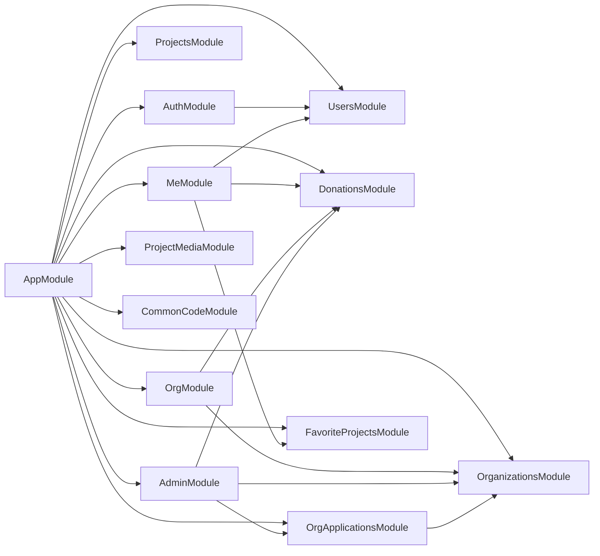

---

## 3. 도메인 모델 (ER Diagram)

```mermaid
erDiagram
    User {
        int userId PK
        varchar email UK
        varchar passwordHash "nullable"
        varchar loginPlatform
        varchar walletAddress UK "nullable"
        boolean isActive "DEFAULT true"
        varchar role "DEFAULT DONOR"
        datetime createdAt
    }

    Organization {
        int orgId PK
        varchar name
        varchar registrationNumber UK "nullable"
        text description "nullable"
        varchar logoUrl "nullable"
        varchar walletAddress UK "nullable"
        boolean isVerified "DEFAULT false"
        varchar planType "DEFAULT FREE"
        varchar status "DEFAULT PENDING"
        datetime createdAt
        datetime updatedAt "nullable"
    }

    Project {
        int projectId PK
        int orgId FK "nullable"
        int beneficiaryId FK "nullable"
        varchar nation
        varchar title
        decimal goalAmount "nullable"
        decimal currentRaisedUsdc "DEFAULT 0"
        varchar status
        date startDate "nullable"
    }

    Donation {
        int donationId PK
        int userId FK "nullable"
        int projectId FK
        decimal fiatAmount "nullable"
        decimal coinAmount
        varchar coinType
        varchar transactionHash UK
        boolean isAnonymous "DEFAULT false"
        varchar status
        datetime donationDate
    }

    OrgApplication {
        int applicationId PK
        int userId FK
        varchar orgName
        varchar status "DEFAULT PENDING"
        text rejectedReason "nullable"
        datetime reviewedAt "nullable"
        datetime createdAt
    }

    OrgMember {
        int orgMemberId PK
        int orgId FK
        int userId FK
        varchar role "DEFAULT ADMIN"
        datetime joinedAt
    }

    Beneficiary {
        int beneficiaryId PK
        varchar name
        varchar walletAddress UK
        boolean isVerified "DEFAULT false"
    }

    FavoriteProject {
        int userId PK_FK
        int projectId PK_FK
        datetime favoritedAt
    }

    ProjectMedia {
        int mediaId PK
        int projectId FK
        varchar mediaUrl
        varchar mediaType
        varchar contentType
    }

    GroupCode {
        varchar groupCode PK
        varchar groupName
    }

    CommonCode {
        varchar groupCode PK_FK
        varchar codeId PK
        varchar codeName
    }

    User ||--o{ Donation : "makes"
    User ||--o{ FavoriteProject : "favorites"
    User ||--o{ OrgApplication : "submits"
    User ||--o{ OrgMember : "belongs to"
    Organization ||--o{ OrgMember : "has members"
    Organization ||--o{ Project : "manages"
    Project ||--o{ Donation : "receives"
    Project ||--o{ ProjectMedia : "has media"
    Project ||--o{ FavoriteProject : "favorited by"
    Project }o--|| Beneficiary : "benefits"
    GroupCode ||--o{ CommonCode : "contains"
```

---

## 4. 상태 전이 다이어그램

### 4-1. OrgApplication 상태 전이

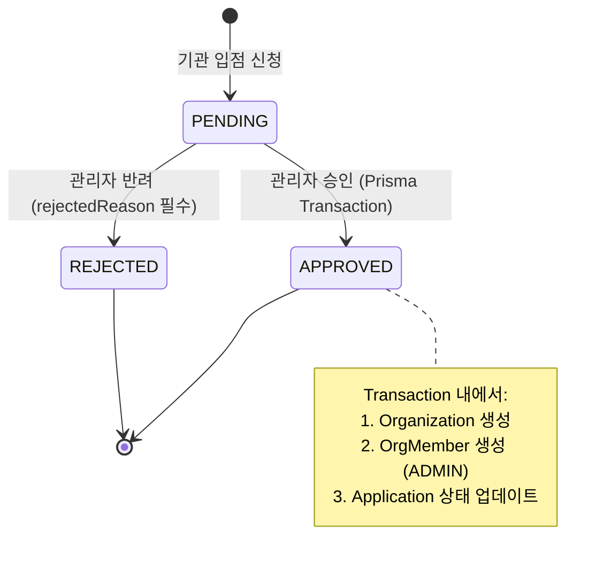

### 4-2. Organization 상태 전이

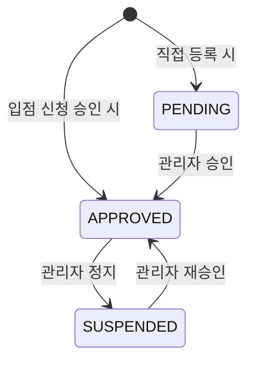

### 4-3. Donation 상태 전이

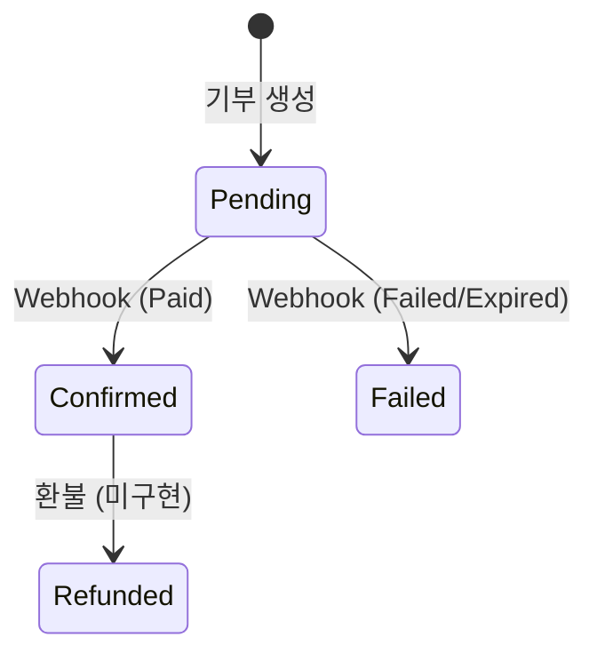

### 4-4. Project 상태 전이

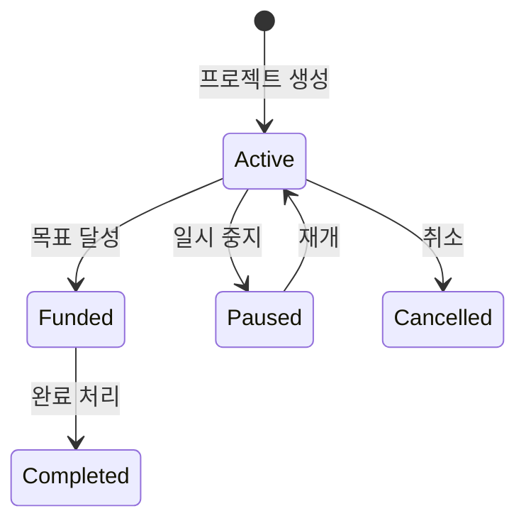

---

## 5. 시퀀스 다이어그램

### 5-1. Google OAuth 로그인 흐름

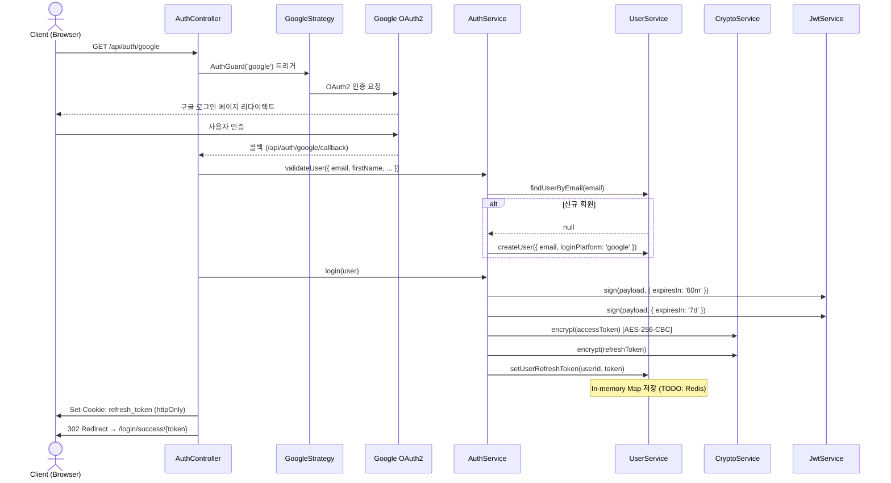

### 5-2. 기관 입점 신청 및 승인 흐름

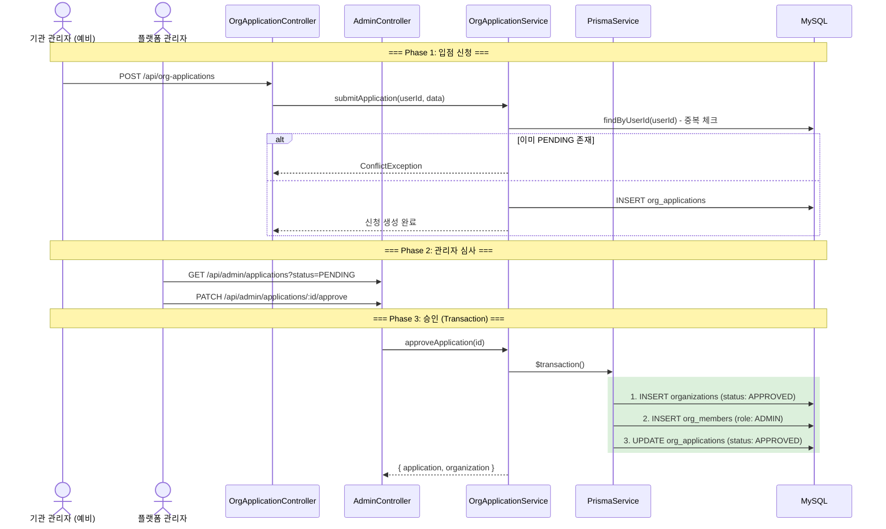

### 5-3. 기부 흐름 (결제 ~ 온체인 분배)

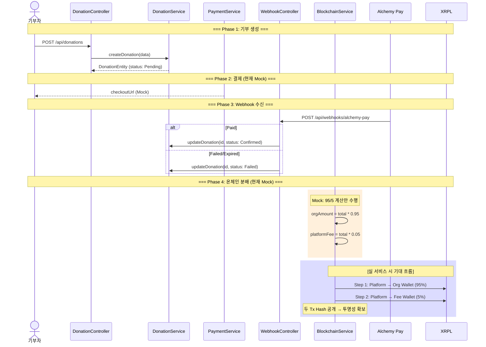

### 5-4. 기관 대시보드 접근 흐름

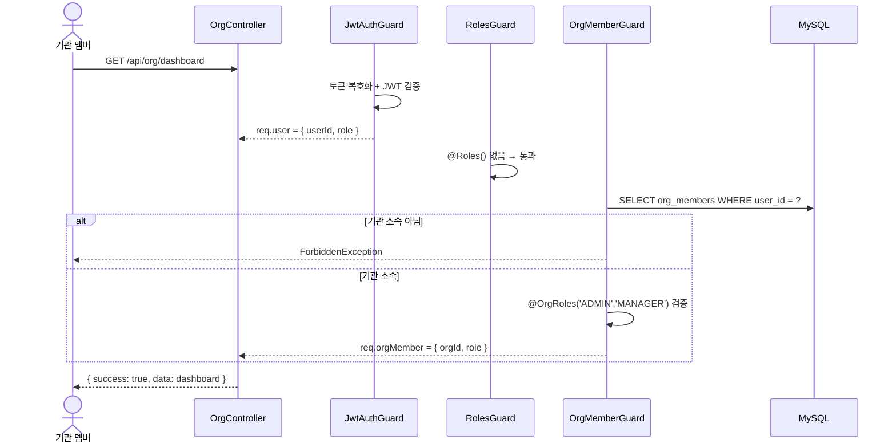

### 5-5. 관리자 기관 심사 흐름

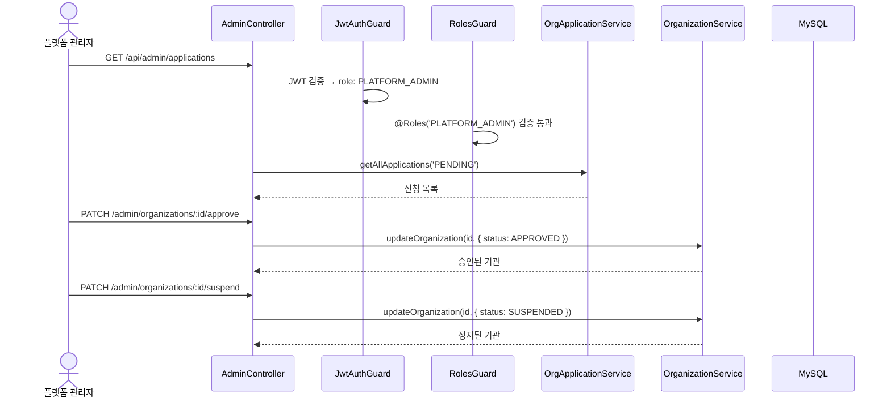

---

## 6. API 엔드포인트 맵 (55개)

### Auth (`/api/auth`) - 6개

| Method | Path | Auth | Description |
|--------|------|------|-------------|
| GET | `/api/auth/google` | Public | 구글 OAuth2 시작 |
| GET | `/api/auth/google/callback` | Public | 구글 OAuth2 콜백 |
| GET | `/api/auth/login/success/:token` | - | 로그인 성공 |
| GET | `/api/auth/login/failure` | - | 로그인 실패 |
| GET | `/api/auth/protected` | JWT | 테스트용 |
| POST | `/api/auth/refresh` | Public | 토큰 갱신 |

### Users (`/api/users`) - 3개

| Method | Path | Auth | Description |
|--------|------|------|-------------|
| POST | `/api/users/register` | JWT* | 이메일 가입 |
| POST | `/api/users/login` | JWT* | 이메일 로그인 |
| GET | `/api/users/info` | JWT | 사용자 정보 |

### My Page (`/api/me`) - 8개

| Method | Path | Auth | Description |
|--------|------|------|-------------|
| GET | `/api/me/donations` | JWT | 내 기부 내역 |
| GET | `/api/me/favorites` | JWT | 좋아요 프로젝트 |
| POST | `/api/me/favorites/:projectId` | JWT | 좋아요 추가 |
| DELETE | `/api/me/favorites/:projectId` | JWT | 좋아요 삭제 |
| GET | `/api/me/profile` | JWT | 내 프로필 |
| PATCH | `/api/me/profile` | JWT | 프로필 수정 |
| GET | `/api/me/wallet` | JWT | 내 지갑 |
| PATCH | `/api/me/wallet` | JWT | 지갑 변경 |

### Donations (`/api/donations`) - 6개

| Method | Path | Auth | Description |
|--------|------|------|-------------|
| POST | `/api/donations` | JWT | 기부 생성 |
| GET | `/api/donations` | JWT | 기부 목록 (필터) |
| GET | `/api/donations/:id` | JWT | 기부 상세 |
| GET | `/api/donations/:id/certificate` | JWT | 기부 증명서 |
| GET | `/api/donations/user/:userId` | JWT | 사용자별 기부 |
| GET | `/api/donations/project/:projectId` | JWT | 프로젝트별 기부 |

### Organizations (`/api/organizations`) - 5개

| Method | Path | Auth | Description |
|--------|------|------|-------------|
| POST | `/api/organizations` | JWT | 기관 등록 |
| GET | `/api/organizations` | JWT | 기관 리스트 |
| GET | `/api/organizations/:id` | JWT | 기관 상세 |
| PATCH | `/api/organizations/:id` | JWT | 기관 수정 |
| PATCH | `/api/organizations/:id/wallet` | JWT | 지갑 등록 |

### Org Applications (`/api/org-applications`) - 3개

| Method | Path | Auth | Description |
|--------|------|------|-------------|
| POST | `/api/org-applications` | JWT | 입점 신청 |
| GET | `/api/org-applications/my` | JWT | 내 신청 내역 |
| GET | `/api/org-applications/:id` | JWT | 신청 상세 |

### Org Dashboard (`/api/org`) - 7개

| Method | Path | Auth | Description |
|--------|------|------|-------------|
| GET | `/api/org/dashboard` | JWT + OrgMember(ADMIN,MANAGER) | 대시보드 |
| GET | `/api/org/donations` | JWT + OrgMember(ADMIN,MANAGER) | 수령 기부 내역 |
| GET | `/api/org/donations/:id` | JWT + OrgMember(ADMIN,MANAGER,VIEWER) | 수령 기부 상세 |
| GET | `/api/org/plan` | JWT + OrgMember(ADMIN) | 플랜 정보 |
| POST | `/api/org/plan/upgrade` | JWT + OrgMember(ADMIN) | Plus 업그레이드 (Mock) |
| POST | `/api/org/plan/cancel` | JWT + OrgMember(ADMIN) | 구독 해지 |
| GET | `/api/org/reports` | JWT + OrgMember(ADMIN) + Plus | 리포트 (Mock) |

### Admin (`/api/admin`) - 10개

| Method | Path | Auth | Description |
|--------|------|------|-------------|
| GET | `/api/admin/applications` | PLATFORM_ADMIN | 신청 목록 |
| GET | `/api/admin/applications/:id` | PLATFORM_ADMIN | 신청 상세 |
| PATCH | `/api/admin/applications/:id/approve` | PLATFORM_ADMIN | 신청 승인 |
| PATCH | `/api/admin/applications/:id/reject` | PLATFORM_ADMIN | 신청 반려 |
| GET | `/api/admin/organizations` | PLATFORM_ADMIN | 기관 목록 |
| PATCH | `/api/admin/organizations/:id/approve` | PLATFORM_ADMIN | 기관 승인 |
| PATCH | `/api/admin/organizations/:id/suspend` | PLATFORM_ADMIN | 기관 정지 |
| GET | `/api/admin/donations` | PLATFORM_ADMIN | 전체 기부 |
| GET | `/api/admin/settlements` | PLATFORM_ADMIN | 정산 현황 (Mock) |
| GET | `/api/admin/revenue` | PLATFORM_ADMIN | 수수료 현황 (Mock) |

### Webhooks - 1개

| Method | Path | Auth | Description |
|--------|------|------|-------------|
| POST | `/api/webhooks/alchemy-pay` | Public | Alchemy Pay 웹훅 |

### Reports - 2개, Projects - 3개 (Swagger 제외), CommonCode - 1개 (Swagger 제외)

---

## 7. 모듈 의존성 매트릭스

| Module | Imports | Providers (주요) | Exports | Controllers |
|--------|---------|-----------------|---------|-------------|
| AppModule | All modules | JwtAuthGuard, RolesGuard (APP_GUARD) | - | - |
| AuthModule | UsersModule, PassportModule, JwtModule | AuthService, GoogleStrategy, JwtStrategy, CryptoService | AuthService | AuthController |
| UsersModule | PrismaModule | UserService, IUsersRepository→UserRepository | UserService | UserController |
| ProjectsModule | PrismaModule | ProjectService, IProjectsRepository→ProjectRepository | ProjectService | ProjectController |
| OrganizationsModule | PrismaModule | OrganizationService, IOrganizationsRepository→OrganizationRepository | OrganizationService, IOrganizationsRepository | OrganizationController |
| DonationsModule | PrismaModule | DonationService, IDonationsRepository, IPaymentService→Mock, IBlockchainService→Mock | DonationService | DonationController, WebhookController |
| OrgApplicationsModule | PrismaModule, OrganizationsModule | OrgApplicationService, IOrgApplicationsRepository, IOrgMembersRepository | OrgApplicationService, IOrgMembersRepository | OrgApplicationController |
| MeModule | DonationsModule, FavoriteProjectsModule, UsersModule | - | - | MeController |
| OrgModule | OrganizationsModule, DonationsModule, PrismaModule | - | - | OrgController |
| AdminModule | OrganizationsModule, DonationsModule, OrgApplicationsModule | - | - | AdminController, ReportController |

---

## 8. 구현 현황 대비 요구사항 Gap 분석

### 8-1. 기능별 완성도

| 기능 | 요구사항 | 현재 구현 | 완성도 | 우선순위 |
|------|---------|-----------|--------|----------|
| Google OAuth 인증 | 구글 로그인 | GoogleStrategy + JWT + AES + Refresh Token | **90%** | - |
| 기관 입점 신청 | 기관 등록 신청 | OrgApplication CRUD + 중복 방지 | **85%** | - |
| 기관 입점 심사 | 관리자 승인/반려 | AdminController + Prisma Transaction | **90%** | - |
| 기관 프로필 관리 | 정보 수정/공개 | Organization CRUD | **75%** | P1 |
| 기부 처리 | 기부~결제~확정 | Donation CRUD + Webhook | **50%** | P0 |
| **결제 연동 (Alchemy Pay)** | 실 결제 처리 | MockPaymentService만 존재 | **10%** | **P0** |
| **온체인 분배 (XRPL)** | 95/5 분배 + Tx Hash | MockBlockchainService만 존재 | **10%** | **P0** |
| **정산/대사** | 정산 현황 모니터링 | Mock 응답만 존재, Settlement 모델 없음 | **0%** | **P0** |
| 플랜 시스템 | Free/Plus 구분 | planType 필드 + Mock 업그레이드 | **50%** | P1 |
| 캠페인 관리 | Plus 캠페인 생성/노출 | 미구현 | **0%** | P2 |
| 리포트 | 기부 통계 + 다운로드 | Mock 데이터만 반환 | **10%** | P1 |
| 멤버 관리 | 초대/역할 관리 | OrgMember 모델 + Guard만 존재 | **30%** | P1 |
| 기부 증명서 | PDF 발급 | 단순 데이터 반환 | **30%** | P2 |
| 신고/모더레이션 | 신고 접수+처리 | Stub 엔드포인트만 존재 | **10%** | P2 |

### 8-2. 우선순위 분류

**P0 (Critical - 서비스 런칭 차단):**

1. Alchemy Pay 실 결제 연동
2. XRPL 온체인 분배 구현
3. 정산/대사 시스템 구축
4. Donation 테이블에 분배 Tx Hash 필드 추가
5. Webhook 서명 검증 구현

**P1 (High - 핵심 기능 완성):**

1. Refresh Token Redis 전환
2. 기관 프로필 소유자 권한 검증
3. 플랜 구독 결제 연동
4. 멤버 관리 API
5. 실 리포트 집계 로직
6. Email 로그인 @Public() 적용

**P2 (Medium - 부가 기능):**

1. 캠페인 관리 시스템
2. 기부 증명서 PDF 생성
3. 신고/모더레이션 시스템
4. Kakao/Apple 소셜 로그인

---

## 9. 기술 부채 및 리스크

### 9-1. 보안 이슈 (HIGH)

| 항목 | 위험도 | 상세 |
|------|--------|------|
| Refresh Token In-Memory 저장 | HIGH | `UserService.refreshTokens = new Map()` → 서버 재시작 시 유실 |
| Webhook 서명 미검증 | HIGH | `verifyWebhook()` 항상 true 반환 → 가짜 Webhook 공격 가능 |
| 기본 암호화 키 하드코딩 | HIGH | ENCRYPTION_KEY 미설정 시 기본값 사용 |
| 기본 JWT Secret 하드코딩 | HIGH | JWT_SECRET 미설정 시 'secretKey' 사용 |
| 기관 프로필 권한 미검증 | MEDIUM | 인증된 사용자면 아무 기관이나 수정 가능 |

### 9-2. 아키텍처 이슈

| 항목 | 심각도 | 상세 |
|------|--------|------|
| OrgApplicationService의 PrismaService 직접 의존 | MEDIUM | Clean Architecture 위반, Transaction Manager 추상화 필요 |
| DonationService와 Payment/Blockchain 미연결 | HIGH | DonationsModule에서 Provider 등록만, Service에서 미사용 |
| UserService 이중 로그인 로직 | LOW | Email/OAuth 로그인 경로의 토큰 생성 방식이 다름 |

---

## 10. 권장 구현 로드맵

### Phase 1: 보안 및 핵심 인프라 (2-3주)

- Redis Refresh Token 전환
- 환경변수 기본값 제거 및 검증
- GlobalValidationPipe 등록
- 기관 프로필 소유자 권한 검증
- Rate Limiting, 구조화 로깅

### Phase 2: 결제 및 블록체인 연동 (4-6주)

- AlchemyPayService 실 구현체 개발
- XrplBlockchainService 실 구현체 개발
- Prisma Schema에 orgTxHash, feeTxHash 필드 추가
- DonationService에 Payment/Blockchain 서비스 연결
- Webhook 서명 검증 구현

### Phase 3: 정산 및 플랜 시스템 (3-4주)

- Settlement 도메인 모델 설계
- 정산 스케줄러 (Cron)
- 플랜 구독 결제 연동
- 기부 통계 집계 + CSV 다운로드

### Phase 4: 부가 기능 (3-4주)

- 멤버 관리 API (초대/제거/역할 변경)
- Campaign 모델 및 CRUD
- 기부 증명서 PDF
- 신고/모더레이션 시스템

### Phase 5: 프로덕션 준비 (2-3주)

- 통합/E2E 테스트 커버리지
- API 문서 완성
- CI/CD, 모니터링 구축

---

## 핵심 파일 참조

| 파일 | 역할 | 비고 |
|------|------|------|
| `src/application/service/donation.service.ts` | 기부 핵심 로직 | Payment/Blockchain 연동 지점 |
| `src/application/service/org-application.service.ts` | 입점 승인 트랜잭션 | Clean Architecture 리팩토링 대상 |
| `src/application/service/mock-blockchain.service.ts` | Mock 블록체인 | XRPL 실 연동으로 교체 필요 |
| `src/application/service/mock-payment.service.ts` | Mock 결제 | Alchemy Pay 실 연동으로 교체 필요 |
| `src/application/service/user.service.ts` | 사용자 + Refresh Token | Redis 전환 대상 |
| `prisma/schema.prisma` | DB 스키마 | Tx Hash 필드 추가 필요 |
| `src/infrastructure/auth/guard/org-member.guard.ts` | 기관 멤버 인증 | 멤버 관리 확장 지점 |
